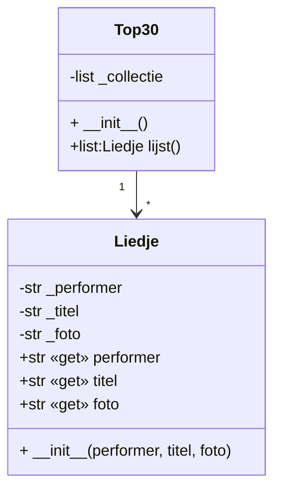

```mermaid
classDiagram
    class Liedje {
        -str _performer
        -str _titel
        -str _foto
        +str «get» performer
        +str «get» titel
        +str «get» foto
        + \_\_init\_\_(performer, titel, foto)
    }

    class Top30 {
        -list _collectie
        + \_\_init\_\_()
        +list:Liedje lijst()
    }

    Top30 "1" --> "*" Liedje
```